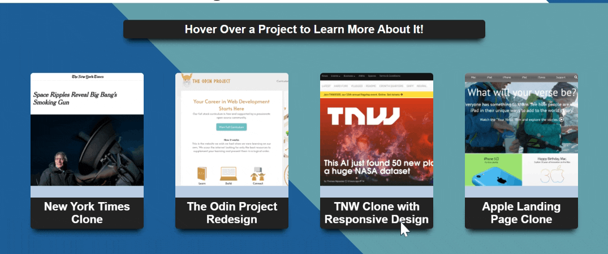
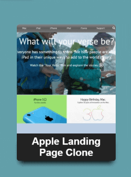

# design_teardowns_clones
This is a project I created to showcase a series of design teardowns and clones that I completed as part of theodinproject.com's online curriculum.  
To view the project you follow this link:  
https://paul-schultz.github.io/design_teardowns_clones/  
And scroll over one of the cards to flip it and learn more about what techniques I used to create the page:  
  
And then click on the backside button to visit the page:  
  
And then once you are done looking at the page there is a button to take you back to the gallery!
